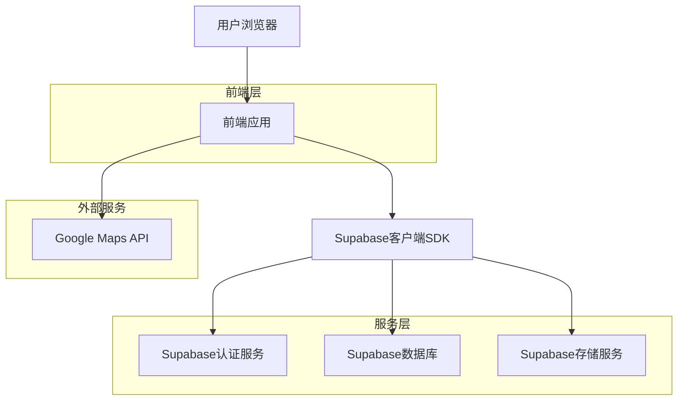
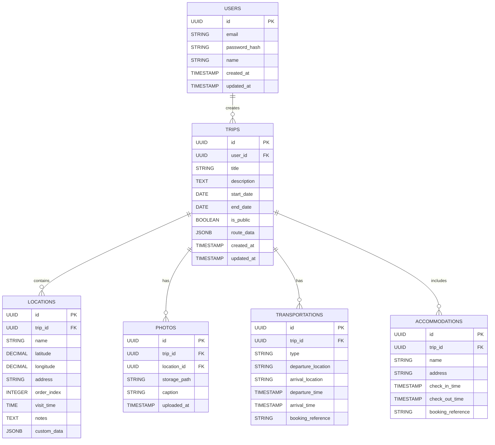

## 1. 架构设计



## 2. 技术描述

- **前端**: HTML5 + CSS3 + JavaScript(ES6+) / React 18 + Vite + TypeScript
- **状态管理**: Zustand (集成 persist 持久化，保障刷新不丢失)
- **UI框架**: Tailwind CSS + Lucide React 图标
- **后端**: Supabase(提供认证、数据库、存储服务)，基于 Supabase Auth 提供邮箱注册/登录机制，以及集成 Google OAuth 实现第三方快捷登录。所有子实体(航班、住宿、地点)严格保持数据库同步CRUD
- **地图服务**: Google Maps JavaScript API + Places API (New) (使用 PlaceAutocompleteElement 实现地点自动补全与坐标获取)
- **移动端地图交互**: 全屏地图容器采用动态视口单位(dvh)以贴合手机可视高度；地图手势使用 greedy 策略以支持单指拖动
- **移动端响应式布局**: 页头动作区在移动端使用图标/数字胶囊承载关键入口；日期+时间输入在窄屏下纵向堆叠，避免原生 time 控件溢出挤压
- **PWA支持**: Service Worker + Web App Manifest

## 3. 路由定义

| 路由 | 目的 |
|-------|---------|
| / | 首页，未登录显示产品介绍(Landing)，已登录显示工作台(Dashboard) |
| /create | （可选）创建行程的基础信息填写页面或弹窗 |
| /plan | 行程规划页面，编辑和创建行程 |
| /trip/:id | 行程详情页面，查看具体行程信息 |
| /profile | 个人中心，管理个人信息和行程 |
| /explore | 探索页面，发现其他用户的行程 |
| /login | 登录页面 |
| /register | 注册页面 |

## 4. API定义

### 4.1 认证相关API

**用户注册**
```
POST /auth/v1/signup
```

请求参数：
| 参数名 | 类型 | 必需 | 描述 |
|-----------|-------------|-------------|-------------|
| email | string | true | 用户邮箱地址 |
| password | string | true | 用户密码(最少6位) |

响应示例：
```json
{
  "user": {
    "id": "user-uuid",
    "email": "user@example.com",
    "created_at": "2024-01-01T00:00:00Z"
  },
  "session": {
    "access_token": "jwt-token",
    "refresh_token": "refresh-token"
  }
}
```

**用户登录**
```
POST /auth/v1/token?grant_type=password
```

### 4.2 数据库操作API

**获取用户行程列表**
```
GET /rest/v1/trips?user_id=eq.{user_id}
```

**获取公开行程列表（探索页）**
```
GET /rest/v1/trips?is_public=eq.true&order=created_at.desc
```

说明：公开行程仅用于展示路线参考信息。创建者信息在前端通过单独查询 `public.users`（按 `user_id` 批量 `in`）获取，避免依赖 PostgREST 的外键推断连表。

## 4.3 数据访问与隐私（RLS）

- `trips`：SELECT 允许创建者、协作者、以及 `is_public=true` 的公开行程；UPDATE 仅允许创建者与角色为 `owner/editor` 的协作者
- `trip_members`：仅允许创建者/协作者读取与写入；公开访问者无法读取成员关系
- `locations`：公开行程可读（用于地图与路线展示）；写入仅允许创建者/编辑者
- `transportations` / `accommodations`：公开访问者不可读（保护隐私）；仅创建者/协作者可读写

**创建新行程**
```
POST /rest/v1/trips
```

请求体：
```json
{
  "title": "东京之旅",
  "description": "5天4夜东京深度游",
  "start_date": "2024-04-01",
  "end_date": "2024-04-05",
  "user_id": "user-uuid",
  "is_public": false
}
```

## 5. 数据模型

### 5.1 数据模型定义



### 5.2 数据定义语言

**用户表(users)**
```sql
-- 创建用户表
CREATE TABLE users (
  id UUID PRIMARY KEY DEFAULT gen_random_uuid(),
  email VARCHAR(255) UNIQUE NOT NULL,
  password_hash VARCHAR(255) NOT NULL,
  name VARCHAR(100) NOT NULL,
  avatar_url TEXT,
  created_at TIMESTAMP WITH TIME ZONE DEFAULT NOW(),
  updated_at TIMESTAMP WITH TIME ZONE DEFAULT NOW()
);

-- 创建索引
CREATE INDEX idx_users_email ON users(email);
```

**行程表(trips)**
```sql
-- 创建行程表
CREATE TABLE trips (
  id UUID PRIMARY KEY DEFAULT gen_random_uuid(),
  user_id UUID REFERENCES auth.users(id) ON DELETE CASCADE,
  title VARCHAR(200) NOT NULL,
  description TEXT,
  start_date DATE,
  end_date DATE,
  is_public BOOLEAN DEFAULT false,
  route_data JSONB,
  total_distance DECIMAL(10,2),
  estimated_cost DECIMAL(10,2),
  created_at TIMESTAMP WITH TIME ZONE DEFAULT NOW(),
  updated_at TIMESTAMP WITH TIME ZONE DEFAULT NOW()
);

-- 创建索引
CREATE INDEX idx_trips_user_id ON trips(user_id);
CREATE INDEX idx_trips_created_at ON trips(created_at DESC);
```

**地点表(locations)**
```sql
-- 创建地点表
CREATE TABLE locations (
  id UUID PRIMARY KEY DEFAULT gen_random_uuid(),
  trip_id UUID REFERENCES trips(id) ON DELETE CASCADE,
  name VARCHAR(200) NOT NULL,
  latitude DECIMAL(10,8) NOT NULL,
  longitude DECIMAL(11,8) NOT NULL,
  address TEXT,
  order_index INTEGER,
  visit_time TIME,
  duration_minutes INTEGER,
  notes TEXT,
  custom_data JSONB,
  created_at TIMESTAMP WITH TIME ZONE DEFAULT NOW()
);

-- 创建索引
CREATE INDEX idx_locations_trip_id ON locations(trip_id);
CREATE INDEX idx_locations_order ON locations(trip_id, order_index);
```

**照片表(photos)**
```sql
-- 创建照片表
CREATE TABLE photos (
  id UUID PRIMARY KEY DEFAULT gen_random_uuid(),
  trip_id UUID REFERENCES trips(id) ON DELETE CASCADE,
  location_id UUID REFERENCES locations(id) ON DELETE CASCADE,
  storage_path TEXT NOT NULL,
  caption TEXT,
  uploaded_at TIMESTAMP WITH TIME ZONE DEFAULT NOW()
);

-- 创建索引
CREATE INDEX idx_photos_trip_id ON photos(trip_id);
CREATE INDEX idx_photos_location_id ON photos(location_id);
```

**交通表(transportations)**
```sql
-- 创建交通表（机票/火车等）
CREATE TABLE transportations (
  id UUID PRIMARY KEY DEFAULT gen_random_uuid(),
  trip_id UUID REFERENCES trips(id) ON DELETE CASCADE,
  type VARCHAR(50) NOT NULL, -- flight, train, bus, etc.
  departure_location VARCHAR(200) NOT NULL,
  arrival_location VARCHAR(200) NOT NULL,
  departure_time TIMESTAMP WITH TIME ZONE,
  arrival_time TIMESTAMP WITH TIME ZONE,
  booking_reference VARCHAR(100),
  notes TEXT,
  created_at TIMESTAMP WITH TIME ZONE DEFAULT NOW()
);

-- 创建索引
CREATE INDEX idx_transportations_trip_id ON transportations(trip_id);
```

**住宿表(accommodations)**
```sql
-- 创建住宿表（酒店/民宿等）
CREATE TABLE accommodations (
  id UUID PRIMARY KEY DEFAULT gen_random_uuid(),
  trip_id UUID REFERENCES trips(id) ON DELETE CASCADE,
  name VARCHAR(200) NOT NULL,
  address TEXT,
  check_in_time TIMESTAMP WITH TIME ZONE,
  check_out_time TIMESTAMP WITH TIME ZONE,
  booking_reference VARCHAR(100),
  notes TEXT,
  created_at TIMESTAMP WITH TIME ZONE DEFAULT NOW()
);

-- 创建索引
CREATE INDEX idx_accommodations_trip_id ON accommodations(trip_id);
```

### 5.3 Supabase权限设置

```sql
-- 基本访问权限
GRANT SELECT ON trips TO anon;
GRANT SELECT ON locations TO anon;
GRANT SELECT ON photos TO anon;
GRANT SELECT ON transportations TO anon;
GRANT SELECT ON accommodations TO anon;

-- 认证用户权限
GRANT ALL PRIVILEGES ON trips TO authenticated;
GRANT ALL PRIVILEGES ON locations TO authenticated;
GRANT ALL PRIVILEGES ON photos TO authenticated;
GRANT ALL PRIVILEGES ON transportations TO authenticated;
GRANT ALL PRIVILEGES ON accommodations TO authenticated;

-- RLS策略示例
ALTER TABLE trips ENABLE ROW LEVEL SECURITY;
CREATE POLICY "Users can view their own trips" ON trips
  FOR SELECT USING (auth.uid() = user_id);
CREATE POLICY "Users can insert their own trips" ON trips
  FOR INSERT WITH CHECK (auth.uid() = user_id);
```

## 6. PWA配置

**Web App Manifest(manifest.json)**
```json
{
  "name": "Atlas PRISMX - 智能旅游规划",
  "short_name": "Atlas PRISMX",
  "description": "您的智能旅游规划助手",
  "start_url": "/",
  "display": "standalone",
  "background_color": "#ffffff",
  "theme_color": "#1E3A8A",
  "icons": [
    {
      "src": "/icons/icon-192.png",
      "sizes": "192x192",
      "type": "image/png"
    },
    {
      "src": "/icons/icon-512.png",
      "sizes": "512x512",
      "type": "image/png"
    }
  ]
}
```

**Service Worker基础配置**
- 缓存静态资源(CSS, JS, 图片)
- 实现离线地图数据缓存
- 处理网络请求失败时的回退
- 支持推送通知(后续扩展)

## 7. 性能优化建议

1. **地图优化**：使用地图瓦片缓存，限制同时显示的标记数量
2. **图片优化**：压缩上传图片，使用WebP格式，实现懒加载
3. **数据分页**：行程列表使用虚拟滚动，大数据集分页加载
4. **缓存策略**：利用浏览器缓存和Service Worker缓存关键数据
5. **代码分割**：按路由分割JavaScript代码，减少初始加载时间
