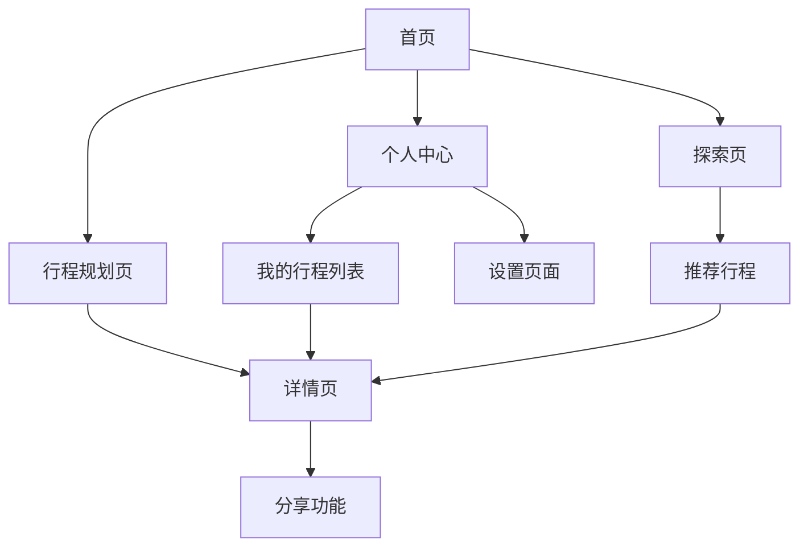

## 1. 产品概述

Atlas PRISMX是一款智能旅游规划Web应用，帮助用户轻松创建、管理和分享个性化的旅行计划。用户可以通过直观的地图界面规划行程路线，保存旅行记忆，并与朋友分享旅行体验。

目标用户群体：热爱旅行、需要便捷规划工具的个人用户和小型旅行团体。产品价值在于简化旅行规划流程，提供一站式旅行管理服务。

## 2. 核心功能

### 2.1 用户角色
| 角色 | 注册方式 | 核心权限 |
|------|----------|----------|
| 普通用户 | 邮箱注册/第三方登录（支持通过 Google 账号进行 OAuth 快捷登录） | 创建个人旅行计划、查看公开行程、基础地图功能 |
| 高级用户 | 应用内升级 | 无限制创建行程、高级路线规划、数据导出功能 |

### 2.2 功能模块

Atlas PRISMX包含以下核心页面：

1. **首页(未登录)**：产品介绍(Landing Page)、功能展示、登录/注册引导
2. **工作台(已登录)**：行程概览、我的行程列表、创建新行程入口
3. **行程规划页**：路线编辑、交通与住宿管理、地点添加、时间安排
4. **详情页**：行程详情、地图标注、照片管理
5. **个人中心**：我的行程、设置、账户管理
6. **探索页**：发现其他用户分享的精彩行程

### 2.3 页面详情

| 页面名称 | 模块名称 | 功能描述 |
|-----------|-------------|---------------------|
| 首页(未登录) | 落地页(Landing) | 展示产品价值主张、核心功能介绍、引导注册/登录 |
| 工作台(已登录) | 行程管理 | 展示用户的所有行程卡片，提供"创建新行程"按钮 |
| 创建行程流程 | 基本信息表单 | 弹窗或独立页面，先填写行程标题、目的地、起始日期（之后可修改） |
| 行程规划页 | 地图编辑器 | 拖拽添加地点，自动计算路线距离和时间，支持多种交通方式 |
| 行程规划页 | 时间轴 | 按天显示行程安排，支持拖拽调整顺序，设置停留时间 |
| 行程规划页 | 交通与住宿 | 录入机票/火车票信息、酒店预订记录，支持关联到具体日期和地点 |
| 行程规划页 | 地点详情 | 添加地点照片、备注、预算信息，查看用户评价和照片 |
| 详情页 | 行程概览 | 显示总天数、总距离、预估费用，支持分享给好友 |
| 详情页 | 地图标注 | 在地图上高亮显示所有行程点，支持点击查看详情 |
| 详情页 | 照片墙 | 按地点分类展示旅行照片，支持批量上传和简单编辑 |
| 个人中心 | 我的行程 | 列表展示所有创建的行程，支持搜索、筛选和排序 |
| 个人中心 | 设置 | 账户信息管理（支持头像点击上传更改）、隐私设置、通知偏好、数据导出 |
| 探索页 | 推荐行程 | 基于位置和用户偏好推荐热门行程，支持按标签筛选 |
| 探索页 | 社区动态 | 展示其他用户最新分享的行程和旅行心得 |

#### 2.4 公开行程隐私规则

- 探索页（公开广场）仅展示用于“路线参考/抄作业”的信息：标题、目的地、总天数、地点与路线地图
- 探索页不展示具体出行日期（年月日），以避免暴露用户的实际行程时间
- 探索页不展示住宿与交通详情（如酒店名称、航班/车次等），以避免暴露敏感行程信息
- 非受邀用户仅可查看公开行程，不具备任何编辑权限；仅行程创建者与被邀请的编辑者可编辑

## 3. 核心流程

### 用户主要操作流程：

1. **新用户注册流程**：访问首页(Landing) → 点击注册 → 填写邮箱密码 → 验证邮箱 → 进入工作台
2. **创建行程流程**：在工作台点击创建行程 → 填写基本资料（标题、目的地、起止日期） → 进入行程规划页 → 在地图上选择景点及录入交通住宿 → 安排每日行程 → 随时保存修改
3. **编辑行程流程**：选择已有行程 → 进入编辑模式 → 随时修改行程基本资料（标题、日期）或删除整个行程（需二次确认） → 添加/删除地点、录入机票与住宿信息 → 调整时间安排 → 保存修改
4. **分享行程流程**：打开行程详情 → 点击分享按钮 → 生成分享链接 → 发送给好友

## 4. 用户界面设计

### 4.1 设计风格
- **主色调**：深海蓝(#1E3A8A)作为主色，搭配明亮橙色(#F97316)作为强调色
- **按钮风格**：圆角矩形设计，移动端适配大按钮(最小44px)，悬停效果明显
- **字体**：系统默认字体，标题18-24px，正文14-16px，确保移动端可读性
- **布局风格**：卡片式布局，底部导航栏(移动端)，侧边栏(桌面端)
- **图标风格**：使用简洁线性图标，支持深色模式自动切换

### 4.2 页面设计概述

| 页面名称 | 模块名称 | UI元素 |
|-----------|-------------|-------------|
| 首页(未登录) | 产品介绍 | 吸引人的Hero Section，功能特色卡片（网格布局），行动呼吁(CTA)按钮 |
| 工作台(已登录) | 行程列表 | 网格/列表展示已有行程卡片，支持批量删除，悬浮的"+"号或显眼的"创建新行程"卡片 |
| 行程规划页 | 顶部信息栏 | 极简白底设计，显示行程标题和日期，右侧提供编辑入口 |
| 行程规划页 | 侧边栏双栏设计 | 左侧极窄垂直时间轴（天数切换），右侧为该天具体行程列表，现代简约风格 |
| 行程规划页 | 悬浮操作按钮(FAB) | 右下角大圆形"+"号按钮，点击展开(添加地点/交通/住宿)选项，替代固定底部栏 |
| 行程规划页 | 排序与交互 | 针对移动端优化：提供大触控区域的"上移"和"下移"按钮代替原生拖拽(Drag & Drop)，提升交互可靠性 |
| 行程规划页 | 智能搜索 | 接入真实 Google Places API 实现地点自动补全与经纬度获取；用户点击搜索结果后弹出确认弹窗，支持选择添加到第几天(带日期)与可选时间，确认后写入行程 |
| 全局组件 | 底部导航栏 | 移动端专属的全局底部导航栏（探索、行程、我的），支持快速切换核心模块 |
| 详情页 | 行程概览 | 顶部大图轮播，基本信息卡片(天数、距离、费用)，底部操作按钮 |
| 个人中心 | 我的行程 | 网格/列表切换视图，显示行程状态标签(进行中/已完成/草稿) |

### 4.3 响应式设计
- **移动端优先**：所有设计以手机端体验为核心，确保单手操作友好
- **断点设计**：320px(手机)、768px(平板)、1024px(桌面)
- **触摸优化**：按钮最小44px间距，支持滑动手势，避免hover依赖
- **PWA适配**：支持离线缓存，添加到主屏幕，推送通知

### 4.4 地图交互指导
- **地图样式**：使用Google Maps的"旅行"主题，突出景点和交通路线
- **标记设计**：自定义彩色图钉，不同类型地点使用不同图标(餐厅、景点、酒店)
- **交互反馈**：点击地点显示信息窗口，支持拖拽重新排序，路线用彩色线条连接
- **移动端手势与全屏**：全屏地图使用动态视口高度(dvh)贴合屏幕，地图支持单指拖动(避免默认“需双指拖动”的提示)
- **性能优化**：地点标记聚类显示，限制同时显示数量，平滑动画过渡
